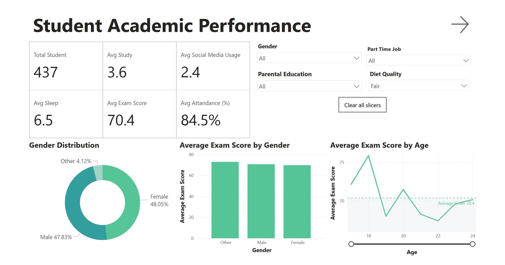
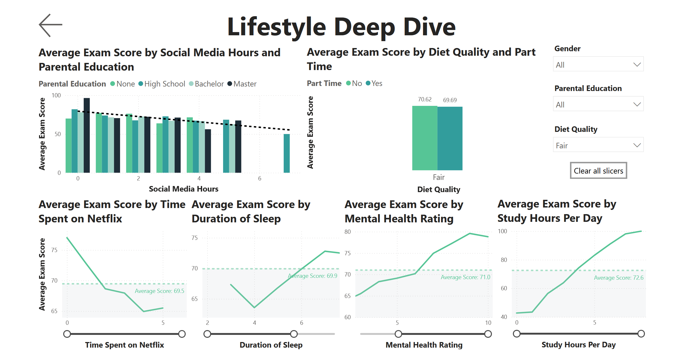

## Project Description
This Power BI dashboard delves into the intricate relationship between various student habits and their academic performance. By visualizing key lifestyle factors, the project aims to identify correlations and provide insights that could potentially inform strategies for improving student outcomes.

### This dashboard is made for
- Teachers and School Leaders
  - To see how students are doing
  - To find problems early
  - To make better plans
  - To understand what works
- Students (and their Parents)
  - To see their own progress
  - To set goals
  - To know what to change

### Dashboard File
You can find the Power BI dashboard here:
- 🔗 [Dashboard File (.pbix)](https://github.com/username/data-science-portfolio/blob/main/power-bi/student-habits-academic-performance/powerbi-student-performance-dashboard.pbix)

### How to Use This Dashboard  

#### 1. Install Power BI Desktop (if you haven't already)  
- Download and install from the official site:  
  🔗 https://powerbi.microsoft.com/desktop

#### 2. Open the `.pbix` file  
- After installing Power BI Desktop, open the downloaded file from this repository (`student_habits_dashboard.pbix`).

#### 3. Explore the Dashboard  
- Navigate between pages using the **buttons at the top** of the screen.
- Use **slicers and filters** on the right to interact with the data (e.g., filter by gender, age, or attendance rate).
- Hover over charts for **tooltips** with more detailed insights.

### Data Source  
The dataset used in this project is available on Kaggle:  
🔗 [Student Habits vs Academic Performance](https://www.kaggle.com/datasets/jayaantanaath/student-habits-vs-academic-performance)

### Preprocessing Data

Prior to building the dashboard, I performed initial data preprocessing using Python to clean and transform the raw dataset. 

You can find the preprocessed dataset here:
- [Dataset](https://github.com/DwikyXYudha/data-science-portfolio/blob/main/power-bi/student-habits-academic-performance/data/student_habits_performance_preprocess_v1.csv)

  
You can find the preprocessed notebook here:
- [Jupyter Notebook](https://github.com/username/data-science-portfolio/blob/main/power-bi/student-habits-academic-performance/notebook/student-habits-academic-performance.ipynb)

## Dashboard Overview
The dashboard is structured into two main interactive pages, designed for comprehensive data exploration:

### Page 1: Performance Overview
- This page provides a high-level summary of student academic performance. It showcases key performance indicators (KPIs) and distributions, offering an initial understanding of the student body.

## Page 2: Habit Correlation
- This page performs a deeper dive into how specific student habits and lifestyle factors correlate with academic performance. It visualizes the relationships, helping to pinpoint influential factors.

## Skills Demonstrated  

This project put key Power BI features into practice. Here's what I mastered:
- Visualization Techniques:
  - Cards: Effectively utilized to highlight key performance indicators and provide immediate insights.
  - Bar Charts: Employed for comparing trends and categories, particularly in showing performance across different groups (e.g., gender, diet quality).
  - Line Charts: Used to illustrate trends and correlations over continuous variables (e.g., age, sleep duration, study hours, Netflix time, mental health rating).
  - Donut Chart: Applied for clearly showing the distribution of categorical data (e.g., gender).
- Dashboard Navigation and User Experience:
    - Buttons & Bookmarks: Integrated to create smooth and intuitive page navigation, ensuring a seamless user experience between the "Performance Overview" and "Habit Correlation" pages.

## Conclusion

The dashboard reveals that **sleep hours**, **study time**, and **mental health rating** have the strongest positive correlations with academic performance. In contrast, **excessive social media use** and **Netflix time** are weakly negatively correlated with exam results. These insights emphasize the importance of encouraging balanced habits and mental well-being to support student achievement. 

## Feedback Request  
This is my **first Power BI dashboard project**, and I'm continuously learning and improving.

If you have any feedback—on layout, usability, visuals, or the analytical approach—**I’d love to hear from you!**  
Your insights would help me grow as a data scientist and improve future projects.

📬 Feel free to reach out via [LinkedIn](https://www.linkedin.com/in/dwikyyudhaprasetya/) or email me at [dwiky.yudh@gmail.com](mailto:dwiky.yudh@gmail.com)
